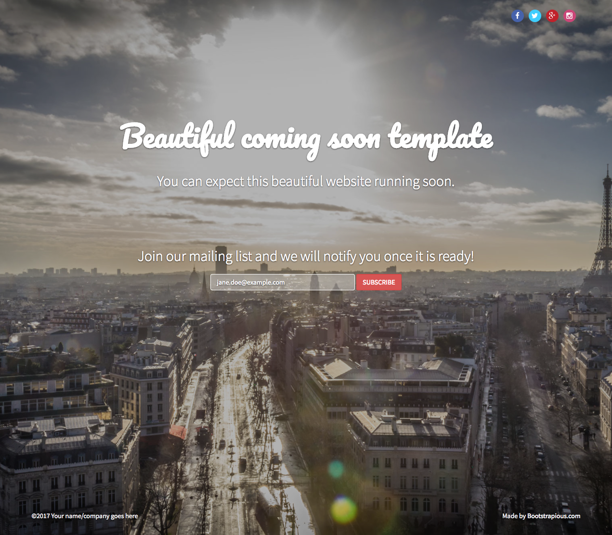

django-sssoon
=============

Django-sssoon is a simple Django app to add beautiful coming soon webpage to your django website. This template is
based on on Bootstrap 3 and designed by [Creative Tim](https://www.creative-tim.com/).



Quick start
-----------
1. django-sssoon is available on the Python Package Index (PyPI), so it can be installed with standard Python tools like `pip` or `easy_install`:

```python
pip install django-sssoon
```

2. Add "sssoon" and "captcha" to your INSTALLED_APPS setting like this:

```python
INSTALLED_APPS = [
    ...
    'captcha',
    'sssoon',
]
```

3. [Sign up for reCAPTCHA](https://www.google.com/recaptcha/intro/index.html), then Add the Google reCAPTCHA keys 
generated to your Django production settings with RECAPTCHA_PUBLIC_KEY and RECAPTCHA_PRIVATE_KEY

```python
# https://github.com/praekelt/django-recaptcha
RECAPTCHA_PUBLIC_KEY = "MyRecaptchaKey123"
RECAPTCHA_PRIVATE_KEY = "MyRecaptchaPrivateKey456"
RECAPTCHA_REQUIRED_SCORE = 0.3
```

4. Include the sssoon URLconf in your project urls.py like this to make your index page coming sssoon:

```python
path('', include('sssoon.urls', namespace="sssoon")),
```

5. Collect static files

```python
python manage.py collectstatic
```

6. Start the development server and visit http://127.0.0.1:8000/
